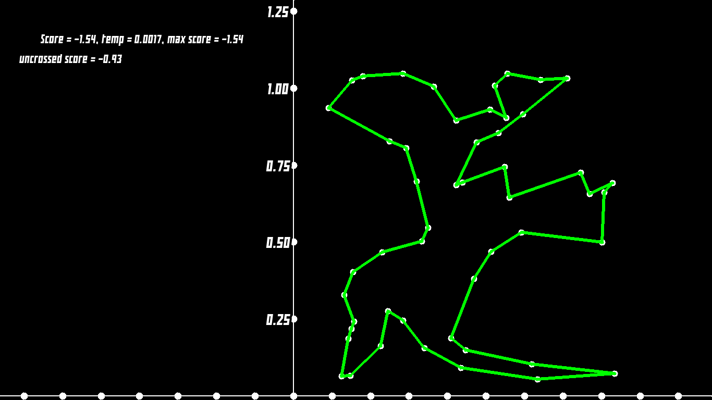

<h1>Travelling Salesman Annealing</h1>
Executes the simulated annealing algorithm to solve the Travelling Salesman Problem

<h4>Installation:</h4>
make to compile 
./travellingsalesmanannealing to run 

<h4>Controls:</h4>
U to start the untangling algorithm 
SPACE to toggle pause 
Mouse1 to move coordinate system 
Mouse2 to display coordinates of mouse pointer 
Scroll Wheel to zoom 

<h4>Dependencies:</h4>
sdl
 
 
 

